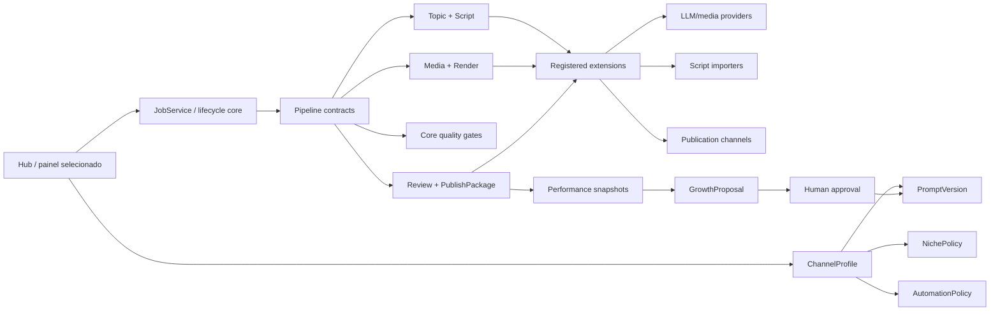

# Auditoria completa e arquitetura de evolucao do ShortsFlow

> Base: commit `08fbea1`, 2026-07-13. Auditoria somente leitura do codigo ativo,
> testes, Remotion, scripts e documentacao. Diretorios de dados/runtime nao foram
> auditados quanto ao conteudo. Nenhuma API real, publicacao ou provider pago foi
> acionado.

## Veredito executivo

O ShortsFlow ja e um produto funcional, nao um prototipo: possui pipeline
auditavel, artefatos, gates, worker, review, agenda, publicacao e coleta de
performance. O melhor caminho nao e reescrever. E preservar os contratos
publicos e corrigir quatro fragilidades estruturais:

1. operacoes criticas ainda nao sao idempotentes em todos os caminhos;
2. Banco de Roteiros confunde entrada editorial com evidencia factual verificada;
3. o prompt viral e texto global mutavel injetado em `notes`, sem versao imutavel;
4. nicho, agenda, metricas e providers ainda dependem de singletons globais.

O limite de 800 linhas e uma boa regra operacional para manutencao por IA, mas
nao deve gerar cortes mecanicos. Use 600-800 linhas como teto de alerta e corte
por ownership. O objetivo e uma mudanca comum exigir dois ou tres arquivos.

O documento `docs/CONTROL.md` diz que a prioridade de negocio atual e provar um
breakout no canal cosmos antes de abrir multinicho. Portanto, implemente agora a
fundacao (`ChannelProfile`, prompt versionado, scoping), mas habilite o segundo
painel somente depois do gate de negocio definido pelo operador.

## Estado verificado

- Stack: Python 3.12, FastAPI, SQLAlchemy, Jinja SSR, SQLite WAL e Remotion.
- Tamanho: cerca de 59 mil linhas entre app e testes.
- Typecheck Remotion: passou (`npm run typecheck`).
- Audit npm de producao em `remotion/`: zero vulnerabilidades reportadas.
- Audit Python: indisponivel; o venv nao possui `pip`/`pip-audit` utilizavel.
- A primeira execucao de `pytest -q` foi contaminada por outro pytest paralelo
  no mesmo `data-test/`. Uma nova execucao isolada passou: `559 passed in
  240.77s`. A interferencia confirma o gap de isolamento descrito no Plano 001.
- Durante a auditoria surgiram mudancas locais nao produzidas por este trabalho
  em seis arquivos ligados ao premium publish gate. Elas nao foram revertidas;
  a execucao limpa acima inclui esse estado, e os drift checks dos planos devem
  ser avaliados antes de implementar.

## Mapa: core, extensoes e poda

| Area | Classificacao | Decisao |
|---|---|---|
| Estados, leases, retries, steps, eventos | Core | Permanecer no lifecycle; tornar transicoes atomicas. |
| Contratos de Script, Cena, Artefato e PublishPackage | Core | Tipar/versionar; nao renomear sem migracao. |
| Factualidade, direitos, integridade de audio/render | Core | Gates nao removiveis e fail-closed. |
| Review humano, agenda e idempotencia de publicacao | Core | Compartilhado por todos os perfis/canais. |
| `ChannelProfile` e scoping de dados | Core novo | Unidade de isolamento para nicho, prompt, agenda e metricas. |
| LLM, imagem, TTS, musica e visao | Extensao | Interfaces tipadas + factories registradas. |
| Fontes de pauta e importadores de roteiro | Extensao | `TopicSource` e `ScriptImporter`. |
| YouTube/TikTok e futuros destinos | Extensao | `PublicationChannel`, mantendo policy no core. |
| Remotion e render legado | Extensao interna | `RenderBackend`; Remotion continua default. |
| Politica editorial de nicho | Perfil declarativo | Nao e plugin executavel; e configuracao versionada validada. |
| `legacy/` | Podar | Nenhum import ativo; quarentena ja cumpriu seu papel. |
| Constantes visuais duplicadas no orquestrador | Podar | Copias mortas; owner ativo e `image_assets.py`. |
| Referencias residuais a Ponytail | Podar | Plugin/script nao existe no tree; remover comentarios de proveniencia e corrigir docs Wayfinder que ainda o tratam como ativo. |
| `app/static/replicar-shortsflow-prompt.md` | Investigar/podar | Sem referencia ativa encontrada; confirmar uso manual antes de excluir. |
| Demo TikTok duplicada | Manter | Dois destinos de hosting distintos. |

## Achados priorizados

| # | Achado | Categoria | Impacto | Esforco | Risco | Evidencia |
|---:|---|---|---|---:|---:|---|
| 1 | Publicacao pode iniciar dois uploads do mesmo job | Bug | Critico | S | MED | `publication_workflow_ops.py:45-95`, `youtube_publication_ops.py:224-254` |
| 2 | Reprocessar/regenerar pode sobrescrever lease vivo | Bug | Alto | S | MED | `orchestrator.py:383-408`, `orchestrator.py:434-496` |
| 3 | Roteiro importado vira fact pack `verified` automaticamente | Corretude | Critico | M | MED | `manual_script.py:98-166`, `manual_script.py:250-269`, `automation.py:116-145` |
| 4 | Cookie autoriza POST apesar do contrato negar isso | Seguranca | Alto | S/M | MED | `main.py:179-223`, `README.md:168`, `docs/PRD.md:538` |
| 5 | Provider/render longo roda dentro de transacao | Performance | Alto | L | HIGH | `orchestrator.py:884-960`, `asset_pipeline.py:97`, `render_pipeline.py:32` |
| 6 | Prompt viral tem regras conflitantes de narracao/tamanho | Editorial | Alto | M | MED | `hub_prompt.py:18-24`, `providers/llm.py:497-524`, `script_pipeline.py:540-578` |
| 7 | Prompt mestre e global, mutavel e transportado por `notes` | Arquitetura | Alto | L | MED | `hub_prompt.py:67-116`, `orchestrator.py:288-305` |
| 8 | Benchmark editorial esta sem executor e na versao v3 | Testes | Alto | M | LOW | `benchmarks/editorial/benchmark.v1.json:1-6`, `retention.py:8` |
| 9 | Script de SQLite->Postgres apaga destino e omite tabelas atuais | Dados | Critico | M | HIGH | `scripts/migrate_sqlite_to_postgres.py:10-49`, `:66-87` |
| 10 | Hub pagina depois de carregar todos os jobs | Performance | Medio/alto | M | MED | `hub_jobs_context.py:63-150` |
| 11 | Candidatos de Analytics fazem consulta 1+N | Performance | Medio | M | LOW | `performance_ops.py:207-248` |
| 12 | Claim do worker nao tem indices compostos adequados | Performance | Medio | S | LOW | `models.py:33-56`, `orchestrator_worker.py:128-152` |
| 13 | Timeout por thread nao cancela chamada LLM | Custo/confiabilidade | Alto | M | MED | `llm_routing.py:378-395` |
| 14 | Historico recente ignora `niche_id` recebido | Multinicho | Alto futuro | S | LOW | `topic_pipeline.py:60-73` |
| 15 | Nicho suportado e configuracao sao globais | Arquitetura | Bloqueador | L | HIGH | `schemas.py:9-45`, `config.py:50`, `base.html:171` |
| 16 | Registries ainda exigem editar core para novo provider | Arquitetura | Medio | M/L | MED | `providers/registry.py:10-27`, `llm_routing.py:454-485` |
| 17 | Hotspots excedem o contexto recomendado | Manutencao | Alto | L | MED | `automation.py`, `monetization_pipeline.py`, `orchestrator.py` |
| 18 | Quarentena e constantes mortas poluem contexto | Poda | Baixo/medio | S | LOW | `legacy/README.md`, `orchestrator.py:126-199` |
| 19 | Docs/comentarios ainda apresentam Ponytail como componente ativo | Poda | Baixo | S | LOW | `monetization_pipeline.py:242`, `premium_publish_gate.py:84`, `docs/wayfinder/` |

### Achados de direcao

- Introduzir `ChannelProfile` antes de qualquer painel novo. Ele deve possuir
  nicho, prompt publicado, thresholds, agenda, bindings de plataforma e escopo
  de metricas. O perfil atual migra para `default` sem mudar URLs inicialmente.
- Transformar prompt/retencao em objetos versionados. Jobs devem apontar para a
  versao exata usada, permitindo comparar resultado sem reconstruir `notes`.
- Transformar recomendacoes de crescimento em `GrowthProposal` aprovavel, nunca
  em mudanca automatica invisivel nem publicacao direta.
- Tornar o Banco de Roteiros a primeira lane multinicho: importar com perfil,
  proveniencia e confirmacao factual explicita e consumir somente pelo perfil.

## Arquitetura alvo

## Multinicho com paineis distintos

### Modelo de dominio

Crie `ChannelProfile` como unidade de isolamento, nao apenas `Niche`:

- `profile_id`, `slug`, `display_name`, `active`, `language`, `timezone`;
- `niche_policy_id` e `published_prompt_version_id`;
- thresholds editoriais, janela/cadencia e horarios de publicacao;
- bindings logicos de YouTube/TikTok (segredos continuam no ambiente/vault);
- flags de automacao, providers permitidos e retention profile promovido.

Adicione `profile_id` a `Job`, `TopicRequest`, `ReadyScriptItem`, agendas,
publicacoes e snapshots que precisem de consulta independente. O backfill cria
um perfil `default-cosmos` e associa todos os registros existentes. Nao inferir
perfil por texto de nicho.

### Rotas e UI

- `/p/{profile_slug}/jobs`
- `/p/{profile_slug}/calendar`
- `/p/{profile_slug}/growth`
- `/p/{profile_slug}/library`
- `/p/{profile_slug}/settings`

O shell e os templates sao compartilhados. Um seletor de perfil altera o
contexto; nao existem copias de `main.py`, CSS ou templates por nicho. Cada
query recebe `ProfileScope` obrigatorio. A home sem perfil redireciona ao ultimo
perfil ou ao default. IDs de job continuam globalmente unicos.

### Rollout sem quebrar

1. Migracao e perfil default invisivel; comportamento identico.
2. Scoping obrigatorio no backend, ainda com uma unica UI.
3. Testes de vazamento entre dois perfis.
4. Seletor e URLs por perfil.
5. Segundo perfil criado desativado.
6. Habilitar apos o gate de negocio do canal cosmos.

## Injecao correta do prompt mestre

O prompt nao deve continuar escondido em `TopicRequest.notes`. Use um
`PromptEnvelope` composto por camadas com precedencia explicita:

1. `system_policy`: formato JSON, seguranca, factualidade e invariantes do app;
2. `profile_master`: voz, nicho, agressividade e estrategia publicada;
3. `retention_delta`: experimento aprovado e limitado;
4. `job_context`: tema, fact pack e historico, sempre tratado como dados;
5. `repair_context`: reasons do gate, apenas em chamadas de repair.

Envie essas camadas como roles separadas quando o provider suportar. Para APIs
de uma mensagem, renderize delimitadores JSON e inclua instrucao explicita de
que `job_context` e conteudo nao confiavel, nao instrucao. Nunca permita que
fonte pesquisada, roteiro importado ou notas substituam `system_policy`.

Cada versao publicada precisa de:

- ID e numero monotonicamente versionado;
- hash do conteudo e autor/data;
- estado `draft`, `published`, `archived`;
- parent/diff e rollback;
- snapshot/hash persistido no job e em `script.json`;
- benchmark e comparacao antes de publicar;
- alteracao via Hub criando nova versao, nunca editando a versao em uso.

Corrija junto as contradicoes atuais: a narracao canonica e
`hook + loop + beats + payoff + ending`; a faixa de palavras deve derivar de
duracao/WPM em uma funcao unica, nao coexistir como `80-120`, `115+` e
`120-140` em prompts diferentes.

## Viralidade e retencao sem perder confiabilidade

O gate atual e util como piso, mas `viral_intensity_gate.py:9-45` e
`:112-159` recompensa vocabulario especifico de choque/tensao. Um modelo pode
aprender a inserir palavras fortes sem melhorar retencao real. Evolua para:

1. gerar 3 hooks, 2 loops e 2 payoffs baratos antes do roteiro final;
2. eliminar candidatos factualmente inseguros com regras deterministicas;
3. ranquear por clareza no primeiro segundo, gap, escalada, surpresa e imagem;
4. usar judge semantico somente na zona cinza;
5. persistir candidatos, score e escolha em `editorial_candidates.json`;
6. ligar a versao escolhida ao resultado maduro do YouTube;
7. promover padrao somente por experimento aprovado e amostra confiavel.

Para imagens, gerar duas propostas apenas para primeira cena e payoff, as cenas
de maior alavancagem. Escolher por coerencia semantica, legibilidade em thumbnail,
contraste e nao antecipacao do payoff. Nao duplicar todas as imagens: custo e
latencia crescem sem evidencia de retorno.

Metricas primarias por perfil: viewed-vs-swiped, retencao/average view percentage,
queda nos primeiros segundos quando disponivel, rewatch, shares por view e
conversao em inscritos. Views isoladas medem distribuicao, nao qualidade do
roteiro. `GrowthProposal` deve sempre carregar janela, volume e confianca.

## Modularizacao recomendada

| Arquivo atual | Corte por ownership | Meta |
|---|---|---:|
| `automation.py` (1476) | run lifecycle, backlog scheduler, ready-script lane, attempt repository | <600 por modulo |
| `monetization_pipeline.py` (1318) | readiness report, rights/facts, metadata/package, performance summary | <700 |
| `orchestrator.py` (1237) | manter lifecycle; mover scene repair e constantes mortas | <750 |
| `script_fact_pack.py` (1010) | query planning, source adapters, evidence normalization | <700 |
| `script_repair.py` (994) | structural repair, factual grounding, claim trace | <700 |
| `providers/llm.py` (945) | protocol/mock, prompt composer, concrete client | <600 |
| `hub_context.py` (828) | manter facade; mover status/detail helpers restantes | <700 |
| `providers/tts.py` (824) | common audio, Edge, ElevenLabs, Gemini | <500 |
| `styles.css` (6932) | tokens/shell, jobs, detail, publication, responsive | <1000 por folha |
| `job_detail.html` (994) | partials por area de decisao | <350 por template |

Testes de 2-5 mil linhas tambem devem ser separados por comportamento, mas so
depois de estabilizar fixtures. Nao mover codigo e teste no mesmo commit quando
isso impedir revisar se o comportamento permaneceu igual.

## Performance e dados

- Refatorar steps caros em `read -> external work -> write`, com payload/hash
  imutavel entre fases. Nao manter transacao durante rede/subprocesso.
- Adicionar indices para claim (`status`, `lease_expires_at`, `created_at`) e
  agendas/snapshots conforme queries reais.
- Paginar jobs em SQL e fazer count separado; nao usar `.all()` antes do slice.
- Buscar latest Analytics com subquery/window, removendo 1+N.
- Substituir timeout por thread por timeout nativo do cliente; thread viva apos
  timeout pode continuar cobrando e concorrer com fallback.
- Introduzir Alembic (ou runner equivalente versionado) antes de novas tabelas.
- Reescrever a migracao PostgreSQL: sem credenciais/URLs hardcoded, sem delete
  implicito, incluindo todas as tabelas e com dry-run/contagem/checksum.

## Gaps de testes e operacao

- Falta teste concorrente de dois cliques/workers na publicacao.
- Falta teste de lease vivo para reprocess/regenerate.
- Falta teste que cookie sozinho nao autoriza POST.
- Testes enviam `fact_check_confirmed`, mas a rota/importador o ignora e grava
  `True`; isso precisa de teste negativo.
- Falta teste de isolamento entre perfis/nichos.
- Falta budget/query-count para pagina e Analytics.
- Benchmark editorial nao e executado pela suite.
- Python nao tem lint/typecheck/audit padronizados nem lockfile resolvido.
- Smoke real deve continuar manual e nunca publicar sem autorizacao explicita.

## Roadmap recomendado

### Fase A: proteger o que ja funciona

Execute `001`, `002` e `003`. Saida: baseline confiavel, operacoes idempotentes,
confianca factual correta, migracoes e consultas quentes corrigidas.

### Fase B: tornar criatividade auditavel

Execute `004` no perfil cosmos. Saida: prompt versionado, composer por camadas,
proveniencia e benchmark executavel.

### Fase C: reduzir custo de manutencao

Execute `005` em commits pequenos, com caracterizacao antes de cada movimento.
Nao misturar essa fase com mudanca editorial.

### Fase D: preparar e liberar multinicho

Execute `006` e `007`; mantenha o segundo perfil desativado ate a decisao de
negocio. O primeiro novo nicho deve entrar pelo Banco de Roteiros, nao por
automacao de pauta, para reduzir risco.

### Fase E: extensibilidade controlada

Execute `008` somente depois das fronteiras estabilizarem. Comece por providers
LLM e importador Airtable; nao crie marketplace/dynamic loader nesta fase.

### Fase F: fechar o loop de retencao

Execute `009` depois que prompt, perfil e painel estiverem versionados. Saida:
candidatos editoriais limitados, experimentos profile-scoped e propostas de
crescimento aprovaveis com rollback.

## Definicao global de pronto

- Suite Python limpa e Remotion typecheck verde.
- Nenhuma chamada real/paga ou publicacao em teste.
- Compatibilidade dos artefatos/estados/steps preservada.
- Migracao sobe e desce em copia de banco, com backup e contagens.
- Dois perfis de fixture nao vazam jobs, agenda, prompts ou metricas.
- Cada job registra prompt/profile/experiment version exatos.
- Mudanca editorial so e promovida apos benchmark e evidencia madura.
